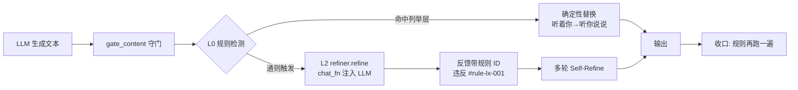

# paeg-lang-style

[](https://www.python.org/)
[](LICENSE)
[](tests/)
[](https://github.com/Golden2002/paeg-lang-style-plugin/pulls)

<p align="center">
  <strong>paeg-lang-style</strong> — 中文语言规范插件：可扩展规则集 + 动态违禁词库 + LLM 输出重写
  <br>
  <em>让 AI 生成的中文"像人话"——规范、朴素、有力量。可拆卸、可独立、可接入任何智能体。</em>
</p>

<p align="center">
  <a href="https://github.com/Golden2002/paeg-lang-style-plugin">GitHub</a> |
  <a href="https://github.com/Golden2002/paeg-lang-style-plugin/issues">报告问题</a>
</p>

> **中文** | [English](README.en.md)

---

## 这是什么

`paeg-lang-style` 是**中文语言规范模块**——三层架构（用户要求）：

| 层 | 能力 | 核心文件 |
|---|---|---|
| **语法规则约束**（最重要） | 词法/句法/标点规则作为**系统提示词**，指挥 LLM 使用完整的词、完整的句法、充分的状语——谁用都拼 | `rule_registry.py` + `prompts/builder.py` |
| **违禁词兜底** | 动态维护的违禁词库（AI 腔/空洞大词/伪共情/廉价鼓励/网络用语），防 LLM 不听话时的底线 | `forbidden.py` |
| **改写脚本** | LLM 输出后处理：检测命中规则 → 反馈带规则 ID → 多轮 Self-Refine 重写 | `refiner.py` + `gate.py` |

源自 PAEG 教育智能体（v0.12-v0.71 迭代），改造为**零宿主依赖**的独立插件——任何 Python 项目都能接入。

## 核心特性

- **可扩充规则集**：规则外置 `data/rules.json`，追加即热加载（`RuleRegistry`）
- **通则指挥 LLM**：词法完整/句法完整/充分状语通则让 LLM 泛化，而非逐词记忆（避免"只把倦优化成疲倦"的狭隘性）
- **确定性兜底**：列举层规则（"我在这里听着你。"→"我就在这里听你说说。"）防 LLM 不听话
- **规则 ID 反馈闭环**：改写反馈带"违反 #rule-lx-001"，形成规则-生成-反馈闭环
- **动态违禁词库**：运行时增删 + 外部 JSON 热加载
- **注入式设计**：`chat_fn` 强制注入——接入你自己的 LLM 调用，零宿主耦合
- **profile 三档**：general / teaching / confessional——按场景拼装系统提示词
- **AI 味检测**：句长变异/过渡词密度/三段式/破折号/段落对称 5 维信号
- **8+ 语法规则**：GB/T 15834 标点规范 + 病句六类 + 教学语言规范
- **75 项测试**全绿 + 20 段行为一致性（vs PAEG 原实现字符串相等）

## 安装

```bash
# 方式 1：pip 安装（推荐）
pip install -e /path/to/paeg-lang-style-plugin

# 方式 2：直接引用（零安装）
# 把 src/ 加入 sys.path 即可
import sys
sys.path.insert(0, "/path/to/paeg-lang-style-plugin/src")
```

要求 Python 3.9+。零第三方运行时依赖。

## 快速开始

**三步走**：安装 → 拼提示词 → 处理输出。

```python
from paeg_lang_style import RuleRegistry, make_refiner, gate_content

# Step 1: 语法规则拼进你的系统提示词（谁用都拼）
system_prompt = "你是教育智能体，负责讲解数学概念。"
system_prompt += RuleRegistry().build_prompt("teaching")   # 通则层指挥 LLM

# Step 2: 注入你的 LLM 调用（改写脚本）
def my_llm(system, user, max_tokens=800, **kw):
    return call_my_llm_api(system, user, max_tokens=max_tokens)

refiner = make_refiner(chat_fn=my_llm)

# Step 3: LLM 输出后处理（L0 规则 + L2 重写）
raw_output = "总的来说，让我们一起赋能这个时代！"
clean = gate_content(raw_output, refiner=refiner)
# → "我们把这个时代里的每一个孩子，把他们的潜能一步步唤起。"
```

## 目录

- [核心概念](#核心概念)
- [外部项目接入指南](#外部项目接入指南)
- [可扩展性](#可扩展性)
- [可维护性](#可维护性)
- [内置语法规则](#内置语法规则)
- [违禁词库](#违禁词库)
- [API 参考](#api-参考)
- [配置参考](#配置参考)
- [架构设计](#架构设计)
- [与 PAEG 主项目集成](#与-paeg-主项目集成)
- [测试](#测试)
- [贡献指南](#贡献指南)
- [更新日志](#更新日志)
- [许可证](#许可证)

## 核心概念

**三层架构 + 规则集数据模型**——可扩充性贯穿规则定义/检测/提示词生成三处：



**规则数据模型**（`Rule`——外置 JSON 可扩充）：

```json
{
  "id": "rule-lx-general-001",
  "type": "general",
  "category": "lexical",
  "pattern": "(倦|乏|沉|累|苦|慌|虚|弱|低|烦|闷|困|急|乱)",
  "replacement": null,
  "message": "存在单字状态词——应扩展为完整双字词形",
  "prompt_block": "### 词法完整通则（指挥 LLM 泛化）...",
  "severity": "high",
  "enabled": true,
  "source": "builtin",
  "profile_tags": ["general", "teaching", "confessional"]
}
```

- **`type: "general"`（通则层）**：`prompt_block` 拼进系统提示词，指挥 LLM 泛化——"凡表达状态/感受的单字形容词一律扩展为完整双字词形（倦/乏/沉/累/苦/慌/虚/弱/低/烦/闷/困/急/乱）"。LLM 自行泛化到未列举词，而非只修"倦→疲倦"。
- **`type: "explicit"`（列举层）**：`pattern + replacement` 确定性兜底——LLM 不听话时的最后防线。

## 外部项目接入指南

> 用户要求：**任何项目/智能体**想使用我们的语法规则模块，该怎么做？

### 场景 A：只想用"语法规则约束"（系统提示词）

```python
from paeg_lang_style import RuleRegistry

# 语法规则拼进自己的系统提示词（谁用都拼）
system = "你是我的客服机器人。"
system += RuleRegistry().build_prompt("general")   # 或 "teaching" / "confessional"
```

`build_prompt(profile)` 返回的规则片段（词法完整通则/句法完整通则/充分状语通则/标点规范），
直接拼接进你的 LLM system prompt。这是"指挥 LLM 使用完整词"的本质——不依赖我们的重写器。

### 场景 B：想用"改写脚本"处理 LLM 输出

```python
from paeg_lang_style import make_refiner, gate_content

# 注入你自己的 LLM 调用包装（chat_fn 强制注入，零宿主耦合）
def my_chat(system, user, max_tokens=800, **kw):
    return call_your_llm(system, user, max_tokens=max_tokens)

refiner = make_refiner(chat_fn=my_chat)
clean = gate_content(your_llm_output, refiner=refiner)   # L0 规则 + L2 重写
# 纯规则（不调 LLM）：
clean = gate_content(your_llm_output)                    # 病句/违禁词确定性修正
```

### 场景 C：想用"违禁词库"

```python
from paeg_lang_style import ForbiddenWords

fb = ForbiddenWords()                     # 内置违禁词（AI 腔/空洞大词/伪共情/网络用语）
fb.load_json("my_words.json")             # 合并你自己的词库（动态扩充）
fb.add("你们公司的禁词")                  # 运行时新增
hits = fb.detect(text)                    # → ["禁词1", "禁词2"]
```

### 场景 D：想扩充规则（可扩展性）

编辑 `data/rules.json`，追加一条规则即热加载：

```json
{
  "rules": [
    {
      "id": "rule-my-001",
      "type": "explicit",
      "category": "lexical",
      "pattern": "你们行业的黑话",
      "replacement": "规范说法",
      "message": "这是行业黑话，应改规范",
      "severity": "medium",
      "enabled": true,
      "source": "user",
      "profile_tags": ["general"]
    }
  ]
}
```

```python
reg = RuleRegistry()
reg.load("data/rules.json")    # 合并（追加即生效）
reg.watch("data/rules.json")   # mtime 变更自动热重载
reg.check_reload()             # 每次调用前检查
```

### 场景 E：完整接入（含规则 ID 反馈闭环）

```python
from paeg_lang_style import RuleRegistry, make_refiner, gate_content, get_style_prompt

# 1. 系统提示词（规则 + 风格）
system = get_style_prompt("all") + "\n" + RuleRegistry().build_prompt("general")

# 2. 改写器（规则检测 → 反馈带 ID → 重写）
refiner = make_refiner(chat_fn=my_chat)

# 3. 守门（L0 规则 + L2 重写 + 收口）
final = gate_content(raw, refiner=refiner)
```

## 可扩展性

| 扩展点 | 方式 | 机制 |
|---|---|---|
| **语法规则** | 编辑 `data/rules.json` 追加 `Rule` | `RuleRegistry.load()` 合并 + `watch()` 热重载 + `PAEG_RULES_PATH` 环境变量覆盖路径 |
| **违禁词** | `ForbiddenWords.load_json("自定义.json")` / `add()` / `remove()` | 运行时动态维护 |
| **语料** | 替换 `data/weil_corpus.json` 为中性语料 | 构造时 `corpus_path` 参数 |
| **profile** | 新增规则时加 `profile_tags` | `build_prompt(profile)` 按场景过滤 |
| **LLM 后端** | 注入任意 `chat_fn` | 强制注入，零宿主耦合 |
| **规则 ID 契约** | 规则 `id` 稳定，反馈引用 | 规则-生成-反馈闭环，便于 telemetry |

## 可维护性

- **零宿主依赖**：不 import 任何宿主项目模块，独立可测
- **旧 API 兼容**：`rules.py`/`rules_enhanced.py` 保留为薄包装，向后兼容
- **75 项测试**：规则集加载/热重载/检测/拼装/用户扩充/损坏容错全覆盖
- **行为一致性**：20 段样本 vs PAEG 原实现字符串相等（零漂移）
- **损坏容错**：JSON 损坏时保留上一份规则集，绝不"清空跑"
- **防膨胀**：`token_budget` 控制系统提示词长度（默认 800）
- **模式清晰**：通则层（指挥 LLM）与列举层（确定性兜底）职责分离

## 内置语法规则

| ID | 类型 | 类别 | 规则 | 触发模式 | 修正 |
|---|---|---|---|---|---|
| `rule-lx-general-001` | 通则 | 词法 | 词法完整 | 单字状态词（倦/乏/沉/累/苦/慌/虚/弱/低/烦/闷/困/急/乱） | 扩展完整双字词形 |
| `rule-sx-general-001` | 通则 | 句法 | 句法完整 | 主谓宾/动宾/介词/复合句 | 成分齐全 |
| `rule-sx-general-002` | 通则 | 句法 | **充分状语** | 动词开头短句/孤零零单动词 | 补时间/地点/方式/条件/对象/目的状语 |
| `rule-pn-general-001` | 通则 | 标点 | 标点规范（GB/T 15834） | 顿号vs逗号/说后冒号 | 标点规范 |
| `rule-lx-001` | 列举 | 词法 | 倦→疲倦 | `觉得倦了\|感到倦\|已倦` | 确定性替换 |
| `rule-lx-002` | 列举 | 词法 | 乏→疲乏 | `的乏($\|[，。；])` | 确定性替换 |
| `rule-lx-003` | 列举 | 词法 | 道出→说出来 | `道出` | 确定性替换 |
| `rule-lx-004` | 列举 | 词法 | 探知→探索并了解 | `探知` | 确定性替换 |
| `rule-sx-001~004` | 列举 | 句法 | "听着你"悬空 | `(我在这里\|在这里\|我)?听着你` + 句末 | 听你说说 |
| `rule-sx-005` | 列举 | 句法 | 悬空宾语 | `与你探讨$` 等 | 补宾语 |
| `rule-sx-006` | 列举 | 句法 | 动宾搭配 | `带着(重量\|分量)` | 有很重的分量 |
| `rule-sx-007` | 列举 | 句法 | 翻译腔冗余 | `进行(一个)?(分析\|讨论\|思考)` | 直接说动词 |
| `rule-pn-001` | 列举 | 标点 | 说后逗号 | `说："` | 改用逗号 |

**充分状语通则详情**（rule-sx-general-002，用户新增）：

> 每个动作/判断用充分的状语交代清楚——时间、地点、方式、条件、对象、目的。
> "复习单词。" → "你可以在每天睡前用十分钟复习单词。"
> "使用这个软件。" → "你可以在每天固定的时间使用这个软件。"

## 违禁词库

| 类别 | 示例 |
|---|---|
| AI 腔套话 | 总的来说 / 综上所述 / 值得注意的是 / 让我们一起 |
| 空洞大词 | 赋能 / 点亮 / 激活 / 重塑 / 升级 / 全方位 |
| 伪共情动词 | 接住（情绪）/ 托住 / 兜住 / 我懂你 / 心疼你 |
| 廉价鼓励 | 加油 / 你真棒 / 你一定可以 |
| 低劣网络用语 | yyds / 绝绝子 / 栓Q / 破防 / 内卷 / 躺平 / 宝子 |
| 空洞赞美形容词 | 深刻 / 全面 / 系统 / 本质 |

**扩充方式**：`ForbiddenWords().load_json("path.json")`——JSON 结构 `{"extra_forbidden": [...], "ai_tells_extra": [...]}`。

## API 参考

### `RuleRegistry`

| 方法 | 签名 | 说明 |
|---|---|---|
| `all()` | `() -> list[Rule]` | 全部规则 |
| `by_id(id)` | `(str) -> Rule\|None` | 按 ID 查规则 |
| `add_rule(rule)` | `(dict) -> bool` | 运行时新增（同 ID 覆盖内置） |
| `remove_rule(id)` | `(str) -> bool` | 运行时移除 |
| `load(path)` | `(str\|None) -> int` | 合并外部 JSON（热加载） |
| `watch(path)` | `(str\|None) -> None` | mtime 监听 |
| `check_reload()` | `() -> bool` | 检查并重载 |
| `detect(text, profile)` | `(str, str\|None) -> list[Rule]` | 检测命中规则 |
| `apply_explicit(text, profile)` | `(str, str\|None) -> str` | 确定性替换 |
| `build_prompt(profile, token_budget)` | `(str, int) -> str` | 拼装系统提示词 |

### `LanguageRefiner` / `make_refiner`

| 方法 | 签名 | 说明 |
|---|---|---|
| `make_refiner(chat_fn, llm, corpus_path)` | `(*, chat_fn, ...) -> LanguageRefiner` | 工厂（chat_fn 必传） |
| `refine(text, context, max_rounds)` | `(str, str, int) -> str` | 多轮 Self-Refine 重写 |
| `check_grammar(text)` | `(str) -> list` | 语法检查 |
| `detect_ai_tells(text)` | `(str) -> list` | 违禁词命中 |
| `detect_ai_taste_signals(text)` | `(str) -> AITasteSignals` | AI 味信号 |

### `gate_content` / `gate_short`

| 函数 | 签名 | 说明 |
|---|---|---|
| `gate_content(text, context, apply_l2, refiner, polish_fn)` | `(str, str, bool, refiner\|None, fn\|None) -> str` | L0 规则 + L2 重写 |
| `gate_short(text, context, refiner, polish_fn)` | `(str, str, ...) -> str` | 短文本快路径（仅 L0） |

### `ForbiddenWords`

| 方法 | 签名 | 说明 |
|---|---|---|
| `add(word)` / `remove(word)` | `(str) -> bool` | 运行时增删 |
| `load_json(path)` | `(str\|None) -> int` | 合并外部词库 |
| `detect(text)` | `(str) -> list` | 命中词列表 |
| `detect_count(text)` | `(str) -> int` | 命中总数 |

### `get_style_prompt`

| 参数 | 说明 |
|---|---|
| `"all"` | 全量语言风格提示词 |
| `"weil"` / `"lexicon"` / `"syntax"` / `"forbidden"` | 分段 |
| `["weil", "syntax"]` | 多段拼接 |

## 配置参考

### 环境变量

| 变量 | 默认值 | 说明 |
|---|---|---|
| `PAEG_RULES_PATH` | `src/paeg_lang_style/data/rules.json` | 规则集路径覆盖 |

### data/ 文件

| 文件 | 用途 | 可扩充 |
|---|---|---|
| `data/rules.json` | 语法规则集 | 是，追加即热加载 |
| `data/forbidden_words.json` | 违禁词库 | 是，动态维护 |
| `data/weil_corpus.json` | 语料 few-shot | 是，可替换 |

## 架构设计

```
宿主系统（任何 Python 项目 / 智能体）
  system_prompt += RuleRegistry().build_prompt()    <- 语法规则拼系统提示词（谁用都拼）
  gate_content(output, refiner=make_refiner(chat))  <- 输出后处理
        |
        | 零宿主依赖（不 import 宿主任何模块）
        v
paeg_lang_style（独立插件）
  +------------------+  +-----------------+  +-----------------+
  | rule_registry    |  | forbidden.py    |  | ai_taste.py     |
  | 可扩充规则集      |  | 动态违禁词库     |  | AI 味检测        |
  +--------+---------+  +--------+--------+  +--------+--------+
           |                    |                     |
           v                    v                     v
  +-----------------------------------------------------------+
  | refiner.py（改写脚本：chat_fn 注入 + 规则 ID 闭环）           |
  | gate.py（守门入口：L0+L2 编排）                              |
  +-----------------------------------------------------------+
  data/（rules.json / forbidden_words.json / 语料）
```

## 与 PAEG 主项目集成

PAEG 教育智能体通过**唯一适配层** `infra/lang_plugin_bridge.py` 接入（R18/R20 零破坏铁律）：

```python
from infra.lang_plugin_bridge import gate_content, get_style_prompt, make_refiner
# 插件挂载 → 走插件；插件未挂载 → 静默回退 PAEG 原实现（旧文件永不删除）
```

详见 [docs/integration_paeg.md](docs/integration_paeg.md)。

## 测试

```bash
python -m pytest tests/ -q
# 75 项：规则集加载/热重载/检测/拼装/用户扩充/损坏容错 + 通则 + 充分状语 + 行为一致性
```

## 贡献指南

欢迎贡献！请阅读 [CONTRIBUTING.md](CONTRIBUTING.md)（待建）了解：
- 新增语法规则：编辑 `data/rules.json` 追加 `Rule`（含测试）
- 新增违禁词：`ForbiddenWords.load_json` 或直接提 PR 进内置词库
- 代码风格：遵循现有模块结构 + 注释规范

## 更新日志

详见 [CHANGELOG.md](CHANGELOG.md)。

## 致谢

- **PAEG 教育智能体**（v0.12-v0.71 迭代）——本插件提取自其语言规范模块
- **LanguageTool**——规则声明式引擎范式（[dev.languagetool.org](https://dev.languagetool.org/development-overview)）
- **textstat**——可读性度量范式（[github.com/textstat/textstat](https://github.com/textstat/textstat)）
- **GB/T 15834-2011《标点符号用法》**——标点规则国家标准
- **Agent Skills 标准**——渐进披露范式（[agentskills.io](https://agentskills.io)）

## 许可证

MIT © 2026 PAEG Team — 详见 [LICENSE](LICENSE) 文件。
